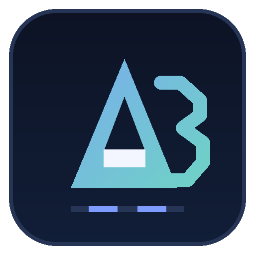

# AD3 Editing

<p align="center"></p>

**Agentic video editing for AI agents and human editors.**  
Editor de vídeo agêntico com IA e edição humana.

AI agents work through a structured CLI and composition code. People work on the
canvas and timeline. Both edit the same project, with changes written back to its
SolidJS/TypeScript source.

[Download Windows / macOS](https://github.com/Ad3Digital/ad3-editing/releases/latest) ·
[CLI reference](reference/README.md) ·
[Composition reference](reference/jsx/README.md) ·
[Issues](https://github.com/Ad3Digital/ad3-editing/issues)

## AI and humans, in the same editing workflow

- An agent can inspect footage, open projects, edit composition files, capture
  preview frames, check scenes, and export through `dapi`.
- A human can review the result, cut and trim clips, adjust the canvas, and finish
  the edit in the desktop interface.
- Canvas and timeline changes are written back into the composition source.
  Editing the source recompiles the project and updates the preview.
- Projects remain ordinary local folders, suitable for version control and use
  with any coding agent that can access the filesystem and terminal.

The editor is **model-agnostic**. This release does not bundle an LLM or a chat
service: bring your own coding agent and its credentials. The packaged desktop
workflow is local-only; upstream cloud generation, accounts, billing, credits,
analytics, and application auto-updates are not part of this release.

## Install on Windows

Release **0.203.0** supports Windows x64 and macOS on Apple silicon or Intel.

1. Open [Releases](https://github.com/Ad3Digital/ad3-editing/releases/latest).
2. Download `AD3-Editing-x64-Setup.exe`, or extract the portable ZIP.
3. Launch **AD3 Editing**.

The installer is currently **unsigned**. Windows may display a SmartScreen warning.
Only install binaries from the repository's releases or build from source.

For compatibility with existing local installations, the internal executable is
still `Diffusion Studio.exe`. The Squirrel installation directory remains
`%LOCALAPPDATA%\DiffusionStudio`, and the profile remains
`%APPDATA%\Diffusion Studio`. Existing projects do not need a format migration.
The application does not download upstream application updates.

## Install on macOS

1. Open [Releases](https://github.com/Ad3Digital/ad3-editing/releases/latest).
2. Choose `AD3-Editing-darwin-arm64.dmg` for Apple silicon, or
   `AD3-Editing-darwin-x64.dmg` for Intel. Check **Apple menu > About This Mac**
   if you are unsure. ZIP archives are also available.
3. Compare the download's SHA-256 with `SHA256SUMS.txt` in the same release
   (`shasum -a 256 path/to/download.dmg`).
4. Open the DMG, move the app into **Applications**, and launch it.

The macOS builds have **no Apple Developer ID signature or notarization**.
If macOS blocks the first launch, use **System Settings > Privacy & Security >
Open Anyway**, then confirm the one-time prompt. Do not disable Gatekeeper
globally. Native build and smoke jobs run separately for both Mac architectures;
this does not replace checking the first launch on your own Mac.

## HyperFrames motion engine

The **HyperFrames** tab in the left sidebar creates titles, lower thirds, and
animated statistics. Edit their text, colors, duration, frame rate, and dimensions,
or edit the composition's HTML directly.

1. Create a composition and **Save** it.
2. Use **Preview** to play, pause, and seek the source in the embedded player.
3. **Render** locally, then **Insert at playhead** to add a linked timeline clip.
4. Edit and render again. The linked asset updates without recreating or retiming
   its timeline clips.

Opaque compositions produce MP4. **Transparent PNG sequence** preserves alpha for
overlays. HTML, settings, and revisions live in the project's `hyperframes/`
directory; immutable rendered outputs live in `assets/`. Keep the whole project
folder when moving or backing up an edit.

`@ad3/hyperframes-engine` is independent of the editor interface. Electron exposes
its project-scoped save, preview, render, job-status, and cancellation operations
through IPC; the web interface does not start shell commands. Preview servers bind
to loopback, and preview iframes do not receive the desktop bridge.

The application bundles HyperFrames 0.8.30, its browser, and FFmpeg/FFprobe: these
operations do not require a separate Node, browser, or FFmpeg installation.
Built-in templates use native browser animations and work locally. Custom HTML
can introduce its own network dependencies; keep its assets and appropriately
licensed libraries local for offline, reproducible rendering.

## Editing controls

| Input | Action |
| --- | --- |
| Wheel over timeline | Zoom around the cursor |
| Ctrl + wheel | Pan horizontally without changing the zoom or playhead |
| Shift + wheel | Scroll track rows vertically |
| Horizontal trackpad gesture | Pan timeline horizontally |
| J | Reverse shuttle: 2× → 3× → 4× → 5× |
| L | Forward shuttle: 2× → 3× → 4× → 5× |
| K during shuttle | Resume forward playback at 1× |
| K at normal speed | Toggle play/pause |
| Space | Play/pause; hold over the canvas for the hand tool |
| W | Cut at the playhead |
| Q / E | Ripple trim to the previous / next cut |

Changing shuttle direction starts again at 2×. Holding a key does not increase
shuttle speed, and typing inside inputs does not trigger editing shortcuts.
Forward shuttle audio follows playback speed; reverse playback is silent.
Shuttle speed never retimes authored clips or changes export timing.

## Working with an AI agent

On Windows the distribution includes `resources/cli/bin/dapi.cmd`. On macOS use
`AD3 Editing.app/Contents/Resources/cli/bin/dapi`. Invoke the launcher directly or
add its directory to your terminal's PATH. Run `dapi --help` for the full CLI.

```sh
dapi open path/to/project
dapi context
dapi media probe path/to/clip.mp4
dapi media filmstrip path/to/clip.mp4
```

Use the returned scene IDs with `dapi capture` and `dapi check`. `dapi export`
renders a project to a local video file; see its `--help` for output options.
The [CLI reference](reference/README.md) documents arguments and structured output.
Some optional media commands require additional tools or providers; consult their
individual references rather than assuming a bundled cloud service.

A useful division of work is: let the agent assemble and inspect a cut, review it
in the editor, then have the agent check and export the revised composition.

`dapi report` files a **public** issue in this repository and can attach application
logs. Review the diagnostics first, or use `--logs 0` to omit log attachments.
It requires an installed and authenticated GitHub CLI.

## Preview and playback improvements

- Coalesced seek requests instead of an accumulated promise chain.
- Codec output drained for short clips, final frames, and keyframe scrubs.
- Idle decoders reactivated at the requested frame.
- Bounded, indexed preview caches and direct drawing into preview tiles.
- Cache resolution adapted to frame rate within a fixed pixel budget.
- Audio re-anchored after seeks or rate changes, with obsolete work cancelled.

High-resolution, long-GOP footage can show fewer intermediate preview frames
during fast reverse shuttle. Export decoding remains full-resolution.

## Build from source

Use **Node.js 24**, npm, and Git. Build natively on Windows x64, macOS Apple silicon,
or macOS Intel for the corresponding published package. macOS builds also require
the Xcode command-line tools.

```sh
git clone https://github.com/Ad3Digital/ad3-editing.git
cd ad3-editing
npm ci
```

Copy `apps/web/.env.example` to `apps/web/.env` for a new checkout. The template
contains public client configuration; do not commit private credentials or replace
an existing local configuration unnecessarily.

```sh
npm run check
npm run make
```

Outputs:

- Installer: `apps/desktop/out/make/squirrel.windows/x64/AD3-Editing-x64-Setup.exe`
- Portable ZIP: `apps/desktop/out/make/zip/win32/x64/`
- macOS images and ZIPs: `apps/desktop/out/make/`

Packaging stages the pinned HyperFrames runtime and its native tools before
creating the installers. This build step requires network access; running built-in
compositions in the installed application does not. Release jobs launch each
packaged app and exercise preview, MP4 and alpha rendering, timeline insertion,
linked-asset updates, cancellation, and project isolation.

For development, run `npm run dev`. `npm run check` checks all workspaces and the
examples. `npm run lint` runs the repository's linters.

## Repository layout

| Path | Purpose |
| --- | --- |
| `apps/web` | SolidJS editor interface |
| `apps/desktop` | Electron application and Windows/macOS packaging |
| `apps/cli` | Agent-facing `dapi` CLI |
| `packages/runtime` | Scene state, actions, playback, media decoding, and capture |
| `packages/reconciler` | Composition-to-runtime reconciliation |
| `packages/jsx` | Composition authoring API |
| `packages/assets` | Asset library, manifests, probing, and resolution |
| `packages/encoder` | Video, audio, and image export |
| `packages/hyperframes-engine` | Local HyperFrames process engine, templates, and bundled runtime staging |
| `packages/koota-solid` | Solid bindings for the entity runtime |
| `reference` | CLI and composition documentation |
| `examples` | Example compositions |

Internal `@diffusionstudio/*` package names are preserved for composition and API
compatibility. They do not change the public product name or repository owner.

## Origin and license

AD3 Editing is independently maintained by **AD3 Digital** and is based on
[Diffusion Studio Editor](https://github.com/diffusionstudio/editor), including its
SolidJS composition format, runtime, and CLI. This repository begins a new public
AD3 history; that does not replace the authorship or licensing of inherited code.

Source code is available under the **[Mozilla Public License 2.0](LICENSE)**.
Commercial use, modification, and redistribution are permitted. Distributed
modifications to MPL-covered files must remain available under the MPL, and the
applicable notices must be retained. See the license for the complete terms.

Original Diffusion Studio brand assets are not covered by MPL-2.0.
Copyright (c) Diffusion Studio Inc. All rights reserved.
The original AD3 Editing icon and marks created for this fork are supplied under
MPL-2.0. Third-party components and assets retain their respective licenses.

The HyperFrames runtime is Apache-2.0. Packaged third-party notices and native
FFmpeg/FFprobe license output are included under `resources/hyperframes-engine`
(inside `Contents/Resources` on macOS). The bundled FFmpeg is a GPL-licensed
separate executable; see each FFprobe build's captured license for its terms.
Custom composition dependencies keep their own licenses; built-in templates
do not depend on GSAP.
